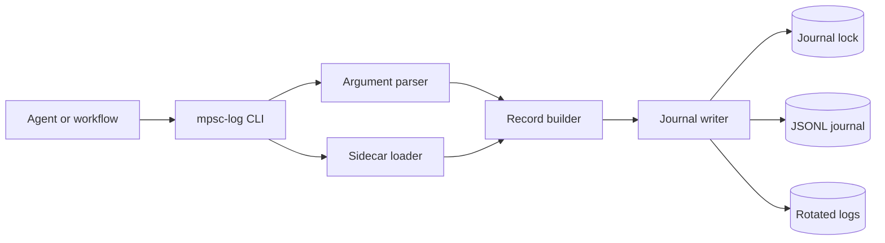
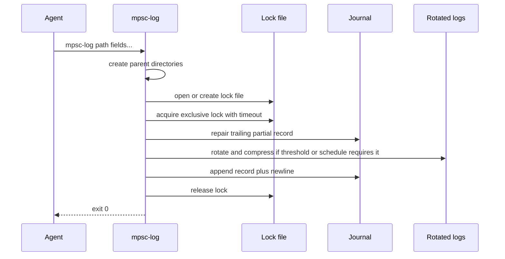

# mpsc-log design

- **Status:** Draft v0.1.
- **Audience:** Implementers, reviewers, and workflow operators.
- **Last substantive revision:** 2026-06-29.
- **Companion documents:**
  - [Terms of reference](terms-of-reference.md).
  - [Context](context.md).
  - [Lock file naming ADR](adr-001-lock-file-naming.md).
  - [Testing strategy ADR](adr-002-testing-strategy.md).
  - [Event schema](mpsc-log-event-schema.json).
  - [Sidecar example](mpsc-log-sidecar.example.toml).
  - [Users' guide](users-guide.md).
  - [Developer guide](developers-guide.md).

## 1. Context

`mpsc-log` is a short-lived Rust command-line interface (CLI) for appending one
JSON object to a shared JSON Lines journal. It exists because multi-agent
workflows need structured telemetry without running a logging daemon or
rewriting the same `jo`, `flock`, append, timeout, and rotation glue in every
caller.

The first integration target is the df12-build Open Dynamic Workflows (ODW)
workflow at `../df12-build.worktrees/codex-annex/workflows/df12-build-odw.js`.
Agents in that workflow will write journal records into a caller-owned workflow
sidecar directory. The records measure phase timing, review rounds, task shape,
CodeRabbit waits and HTTP 429s, audit yield, remediation lane outcomes, and
post-merge defect escape.

## 2. Research baseline

JSON Lines is the journal format because it requires UTF-8, one valid JSON
value per line, and `\n` line termination; it is also described as suitable for
log files and cooperating processes.[^jsonl] `mpsc-log` tightens the JSON Lines
contract by requiring every root value to be an object.

The CLI field grammar follows `jo` where that serves object-record logging.
`jo` supports `key=value`, `key@value`, type coercion flags, object paths,
file-value prefixes, array construction, and duplicate object keys.[^jo]
`mpsc-log` rejects array roots and serializes through `serde_json`, so
duplicate keys resolve by last write rather than producing repeated JSON object
names.

The default `timestamp` field uses RFC 3339 UTC. RFC 3339 defines an Internet
profile of ISO 8601 for timestamps, recommends UTC for interoperability, and
uses `date-time = full-date "T" full-time`.[^rfc3339]

The sidecar configuration uses TOML v1.0.0. TOML v1.0.0 is UTF-8, maps
unambiguously to a hash table, supports dotted keys, and forbids defining the
same key multiple times.[^toml]

Prior art informs the concurrency and rotation choices. `flock(1)` exposes
exclusive locks, non-blocking mode, timeout mode, and explicit timeout exit
status, while warning that NFS and CIFS may have limited lock support.[^flock]
`logrotate(8)` rotates, compresses, removes, and handles logs by size; its
`copytruncate` documentation names a small data-loss window, which this design
avoids by rotating under the same lock used for appends.[^logrotate]

The Rust implementation baseline is conservative:

| Need        | Choice                         | Reason                                                                                            |
| ----------- | ------------------------------ | ------------------------------------------------------------------------------------------------- |
| CLI parsing | `clap` builder API             | Handles help/version/error rendering while allowing raw `jo`-style field tails.[^clap]            |
| JSON        | `serde`, `serde_json`          | Standard Rust serialization stack; object maps naturally enforce last-wins duplicate handling.    |
| TOML        | `toml` crate, TOML v1.0 subset | Current crate supports TOML parsing; the product contract remains v1.0.                           |
| Time        | `jiff`                         | Provides `Timestamp::now()` and RFC 3339-style instant formatting with nanosecond support.[^jiff] |
| Locking     | `fs4` sync feature             | Provides cross-platform file locks without requiring a daemon.[^fs4]                              |
| Gzip        | `flate2` default backend       | Supports gzip streams using a safe Rust default backend.[^flate2]                                 |
| Error types | `thiserror`                    | Exposes semantic errors to the CLI boundary.                                                      |

Table 1: Dependency baseline for implementation.

## 3. Goals and non-goals

### 3.1 Goals

- Create missing parent directories for the journal path.
- Parse the first argument as the journal path and remaining arguments as
  `jo`-style field words and coercion flags.
- Merge sidecar defaults, CLI fields, schema-guided coercions, and generated
  timestamp values into one JSON object.
- Serialize exactly one compact JSON object plus `\n` per successful
  invocation.
- Use one lock per journal to serialize repair, rotation, compression, and
  append.
- Time out lock acquisition after five seconds by default.
- Rotate after 1 MiB by default, keep four plain generations, and gzip older
  generations.
- Optionally rotate on UTC hourly, daily, or weekly boundaries while still
  splitting within a period when the size threshold is reached.
- Provide stable exit codes and diagnostics for agents.

### 3.2 Non-goals

- `mpsc-log` does not provide query, dashboard, alerting, or retention
  analysis.
- `mpsc-log` does not discover df12-build workflow sidecar directories.
- `mpsc-log` does not provide distributed locking across hosts.
- `mpsc-log` does not preserve textual duplicate JSON object keys.
- `mpsc-log` does not guarantee chronological record order by `timestamp`.

## 4. Architecture

The design is a synchronous CLI with a small domain core and filesystem
adapter. The core parses fields, merges configuration, produces a
`serde_json::Map`, and computes rotation actions. The adapter owns directory
creation, sidecar reads, lock acquisition, append, truncate repair, rename, and
gzip compression.



Figure 1: Runtime component topology.

The lock file is the coordination boundary. The naming decision is recorded in
[ADR 001: Lock file naming](adr-001-lock-file-naming.md): `mpsc-log` appends
`.lock` to the complete journal filename in the same directory, reserves
`.lock` journal filenames, and rejects journal paths whose derived sidecar path
would equal the journal path. Every invocation creates parent directories
first, opens the lock file with create semantics, acquires an exclusive lock,
and only then reads configuration, repairs the journal tail, rotates,
compresses, and appends.

## 5. CLI contract

The first positional argument is always the journal path:

```plaintext
mpsc-log <journal-path> [field-or-flag ...]
```

The field tail accepts this subset:

| Syntax           | Meaning                                                    |
| ---------------- | ---------------------------------------------------------- |
| `key=value`      | Insert a value using schema coercion or default inference. |
| `key@value`      | Insert a boolean using `jo` truthiness.                    |
| `key:=path`      | Read JSON from `path` and insert it at `key`.              |
| `key=@path`      | Read `path` as UTF-8 text.                                 |
| `key=:path`      | Read `path` as JSON.                                       |
| `key=%path`      | Read `path` and base64 encode the bytes.                   |
| `-s key=value`   | Force string coercion for the following word.              |
| `-n key=value`   | Force number coercion for the following word.              |
| `-b key=value`   | Force boolean coercion for the following word.             |
| `-d.` or `-d .`  | Set the object-path delimiter for later keys.              |
| `key[]=value`    | Append to an array at `key`.                               |
| `key[sub]=value` | Insert into an object at `key.sub`.                        |

Unsupported `jo` options such as `-a`, `-p`, `-f`, `-D`, `-e`, `-v`, and `-V`
fail with `EX_USAGE`. The root is always an object.

## 6. Sidecar configuration

The sidecar path replaces the journal filename extension with `.toml`; if the
journal has no extension, the sidecar path appends `.toml`. For example,
`run.jsonl` uses `run.toml`, and `run` uses `run.toml`. This is a configuration
sharing rule, not a lock naming rule: accepted same-stem journals such as `run`,
`run.jsonl`, and `run.ndjson` have distinct lock files but share `run.toml`.
Callers needing independent sidecars must choose distinct stems or directories.

The sidecar shape is defined by
[mpsc-log-sidecar.example.toml](mpsc-log-sidecar.example.toml). Configuration
has four tables:

| Table        | Responsibility                                                                                      |
| ------------ | --------------------------------------------------------------------------------------------------- |
| `[rotation]` | `schedule`, `max_bytes`, plain generation count, compressed generation count, and gzip policy.      |
| `[locking]`  | Lock timeout and partial-tail repair mode.                                                          |
| `[defaults]` | Default JSON fields inserted before CLI fields.                                                     |
| `[schema]`   | Object paths mapped to coercion names: `string`, `integer`, `number`, `boolean`, `json`, or `null`. |

Merge and coercion order is deterministic:

| Step | Rule                                                                                  | Winner                                                                                                                                      |
| ---- | ------------------------------------------------------------------------------------- | ------------------------------------------------------------------------------------------------------------------------------------------- |
| 1    | Start with sidecar `[defaults]` converted from TOML values to their JSON equivalents. | Sidecar defaults seed the record.                                                                                                           |
| 2    | Process CLI fields in argument order and write each value to its object path.         | Each CLI field wins over sidecar defaults and over earlier CLI fields at the same path.                                                     |
| 3    | Coerce each CLI value before writing it.                                              | Explicit `-s`, `-n`, and `-b` flags win for that word; otherwise the matching `[schema]` entry wins; otherwise default `jo` inference wins. |
| 4    | Insert the generated invocation timestamp.                                            | The generated canonical UTC `timestamp` is added only when no `timestamp` field exists after defaults and CLI fields.                       |
| 5    | Serialize the resulting object.                                                       | The merged record is written as one compact JSON object.                                                                                    |

The sidecar schema never overrides an explicit CLI coercion flag. Schema
entries affect only values supplied for the matching object path; they do not
change sidecar defaults or the generated timestamp. When default `jo` inference
is used, valid JSON values parse as JSON, empty `key=` becomes `null`, and
other values remain strings.

## 7. Journal write protocol

Each invocation follows one critical section:



Figure 2: Critical-section protocol.

The writer records the active file length before appending. If `write_all`
returns an error, the writer truncates the active file back to that length
before returning. If the process dies during a write, the next invocation's
tail repair scans backward to the final `\n`, validates the remaining final
line if present, and truncates any partial tail before appending.

The append path uses `OpenOptions::append(true).create(true)`. The lock, not
append mode alone, provides cross-process serialization. The design treats NFS,
CIFS, and other filesystems with weak advisory locking as unsupported unless
later verification proves the target mount behaves correctly.

## 8. Rotation protocol

Rotation runs while holding the journal lock. The sidecar `schedule` value is
one of `none`, `hourly`, `daily`, or `weekly`; the default is `none`. There is
no `max_age` setting in the v1 configuration surface.

When `schedule = "none"`, rotation is size-only:

- active threshold: 1 MiB;
- plain generations: four;
- compressed generations: 32;
- newest plain rotation: `<stem>.1<ext>`;
- oldest plain rotation before compression: `<stem>.4<ext>`;
- compressed rotations: `<stem>.5<ext>.gz` through `<stem>.36<ext>.gz`.

For `run.jsonl`, the active path is `run.jsonl`; the newest plain rotation is
`run.1.jsonl`; the first compressed rotation is `run.5.jsonl.gz`.

The size-only rotation order is oldest-to-newest:

1. Delete generation 36 if present.
2. Rename compressed generations upward.
3. Gzip generation 4 into generation 5 and remove generation 4 only after the
   gzip output is complete.
4. Rename plain generations 3 to 4, 2 to 3, and 1 to 2.
5. Rename the active file to generation 1.
6. Create a fresh active file by appending the pending record.

When `schedule` is `hourly`, `daily`, or `weekly`, the command uses UTC period
boundaries derived from the invocation timestamp:

| Schedule | Period beginning                        | Base rotated filename     |
| -------- | --------------------------------------- | ------------------------- |
| `hourly` | UTC hour beginning                      | `run.2026-06-29T14.jsonl` |
| `daily`  | UTC day beginning                       | `run.2026-06-29.jsonl`    |
| `weekly` | UTC ISO week beginning, Monday 00:00:00 | `run.2026-06-29.jsonl`    |

Scheduled rotation is opportunistic rather than daemon-driven. If no invocation
occurs at the exact boundary, the next invocation rotates the previous active
segment before appending the new record. The rotated filename is still based on
the period that produced the records, not the time the rotation was observed.

The scheduled protocol is:

1. Determine the pending record period from the invocation timestamp.
2. Determine the active file period from the first complete record in the
   active log, falling back to the pending period when the active log is empty.
3. If the active period is older than the pending record period, rotate the
   active log into the active period's scheduled filename.
4. If the active log plus the pending record would exceed `max_bytes`, rotate
   the active log into the pending period's next size-split filename.
5. Append the pending record to the active log.

Within a scheduled period, reaching `max_bytes` before the time boundary
creates an interim size split. Size splits add a numeric suffix within that
period: `run.2026-06-29.1.jsonl`, `run.2026-06-29.2.jsonl`, and so on. If a
period has no size splits, its final scheduled archive uses the unsuffixed base
name. If a period already has one or more size-split files, the final archive
at the next time boundary also uses the next numeric suffix so that every file
for that period has an ordered generation number.

Retention and compression are period-based in scheduled mode. The newest four
completed periods remain plain, including all size-split files inside those
periods. Older retained periods are gzipped, and periods beyond
`plain_generations + compressed_generations` are deleted. This keeps hourly,
daily, and weekly retention predictable even when one busy period produces many
size-split files.

All gzip output is written through `atomic-write-file`, then committed. A
failed compression leaves the source generation in place and aborts the
invocation before appending the new record.

## 9. df12-build journal records

The normative JSON Schema lives in
[mpsc-log-event-schema.json](mpsc-log-event-schema.json). The schema requires
`timestamp`, permits additional fields, and reserves structured namespaces for
`run`, `task`, `attempt`, `coderabbit`, `audit`, and `defect`.

The df12-build integration should emit these event names first:

| Event                | Required fields                                                                           | Purpose                                                      |
| -------------------- | ----------------------------------------------------------------------------------------- | ------------------------------------------------------------ |
| `phase.started`      | `run.id`, `attempt.phase`, `attempt.agent`                                                | Start timing a workflow phase.                               |
| `phase.finished`     | `run.id`, `attempt.phase`, `attempt.status`, `attempt.duration_ms`                        | Measure phase duration and outcome.                          |
| `review.round`       | `task.id`, `attempt.phase`, `attempt.round`, `attempt.status`                             | Measure design, code, and expert review round distributions. |
| `task.finished`      | `task.id`, `task.phase`, `task.work_items`, `task.changed_files`, `task.dependency_depth` | Correlate outcome with roadmap shape.                        |
| `coderabbit.attempt` | `coderabbit.status`, `coderabbit.wait_ms`, `coderabbit.retry`, `coderabbit.deferred`      | Measure waits, HTTP 429s, deferrals, and retry success.      |
| `audit.finding`      | `audit.severity`, `audit.lane`, `audit.finding_count`                                     | Measure audit yield and remediation routing.                 |
| `defect.escape`      | `defect.source`, `defect.escaped_from`, `defect.severity`                                 | Measure defects found after merge.                           |

Example invocation:

```sh
mpsc-log .odw/run-20260629/journal.jsonl \
  event=review.round \
  run.id=df12-20260629-001 \
  run.workflow=df12-build-odw \
  task.id=1.2.8 \
  attempt.phase=code-review \
  -n attempt.round=2 \
  attempt.status=changes-requested
```

## 10. Errors and exit codes

The library exposes a semantic error enum. The binary maps it to `sysexits`
style process statuses:

| Exit | Name           | Condition                                                                                |
| ---- | -------------- | ---------------------------------------------------------------------------------------- |
| 0    | `OK`           | Record appended.                                                                         |
| 64   | `EX_USAGE`     | Invalid CLI syntax, unsupported `jo` option, non-object root, or duplicate invalid path. |
| 65   | `EX_DATAERR`   | Invalid JSON, invalid TOML, invalid schema coercion, or malformed sidecar value.         |
| 73   | `EX_CANTCREAT` | Parent directory, lock file, journal, or rotated file cannot be created.                 |
| 74   | `EX_IOERR`     | Write, flush, truncate, rename, compression, or filesystem metadata failure.             |
| 75   | `EX_TEMPFAIL`  | Lock timeout.                                                                            |
| 78   | `EX_CONFIG`    | Sidecar configuration is syntactically valid TOML but semantically invalid.              |

Diagnostics go to standard error as one line:

```plaintext
mpsc-log: <error-code>: <path-or-field>: <human-readable detail>
```

The command writes nothing to standard output on success.

## 11. Correctness properties and verification

The testing strategy is recorded in
[ADR 002: Testing strategy](adr-002-testing-strategy.md). That ADR maps the
repository's required unit, behavioural, snapshot, end-to-end, property-based,
bounded-model, and proof prongs to the design surfaces below.

The implementation must satisfy these properties:

| Property                                                                                                             | Verification method                                                                                          |
| -------------------------------------------------------------------------------------------------------------------- | ------------------------------------------------------------------------------------------------------------ |
| Successful invocations produce exactly one valid JSON object line.                                                   | Behavioural tests and property tests over generated field words.                                             |
| Concurrent successful invocations produce the same number of complete records as successes.                          | Stress test with many processes writing one journal.                                                         |
| Rotation preserves successful records across active, plain rotated, scheduled rotated, and compressed rotated files. | End-to-end test that forces size and scheduled rotation under concurrent writers and counts decoded records. |
| Detected write failures do not leave a partial final line.                                                           | Fault-injection adapter test that fails after partial writes and checks truncate repair.                     |
| Crash-like partial tails are repaired before the next append.                                                        | Fixture with malformed trailing bytes followed by a successful append.                                       |
| CLI coercion follows the accepted `jo` subset.                                                                       | Parameterized examples copied from the accepted `jo` behaviours.                                             |
| Sidecar/CLI precedence is deterministic.                                                                             | Table-driven tests covering defaults, schema coercion, explicit flags, and `timestamp`.                      |

The combination surface is `jo` syntax form × coercion source × object path ×
sidecar default × rotation schedule × rotation state × lock contention. The
test suite must cover pairwise combinations across those axes, plus targeted
cases for size and scheduled rotation under contention and failed filesystem
operations.

Network filesystems remain outside the correctness claim until a separate
platform verification matrix proves lock and rename behaviour for a named
filesystem and mount configuration.

## 12. Module structure

`src/main.rs` owns CLI startup and process exit mapping only. The library owns
the implementation:

| Module    | Responsibility                                                                 |
| --------- | ------------------------------------------------------------------------------ |
| `args`    | Parse the journal path and raw `jo` field tail.                                |
| `fields`  | Parse field words, object paths, coercion flags, and file-value forms.         |
| `config`  | Load and validate sidecar TOML.                                                |
| `record`  | Merge defaults, CLI fields, schema coercions, and generated timestamp.         |
| `journal` | Create directories, acquire locks, repair tails, rotate, compress, and append. |
| `errors`  | Semantic error enum and exit-code mapping.                                     |
| `clock`   | Injectable timestamp source for deterministic tests.                           |
| `fs`      | Filesystem adapter boundary for fault injection.                               |

The first implementation should expose no stable library API beyond what the
binary needs. Public library exports remain internal support until a roadmap
item explicitly commits to a supported API.

## 13. Deferred ADRs

- Accepted `jo` subset and last-wins duplicate-key handling.
- Rotation naming, compression, and retention defaults.
- CLI-only product boundary versus public Rust library API.

## Appendix A. References

[^jsonl]: [JSON Lines](https://jsonlines.org/), accessed 2026-06-29.

[^jo]: Jan-Piet Mens,
       [`jo` manual](https://github.com/jpmens/jo/blob/master/jo.md),
    accessed 2026-06-29.

[^rfc3339]: G. Klyne and C. Newman,
    [RFC 3339: Date and time on the Internet: timestamps](https://www.rfc-editor.org/rfc/rfc3339),
    July 2002, accessed 2026-06-29.

[^toml]: Tom Preston-Werner, Pradyun Gedam, et al.,
    [TOML v1.0.0](https://toml.io/en/v1.0.0), accessed 2026-06-29.

[^flock]: Michael Kerrisk,
          [flock(1) Linux manual page](https://man7.org/linux/man-pages/man1/flock.1.html),
    util-linux manual, accessed 2026-06-29.

[^logrotate]: Michael Kerrisk,
              [logrotate(8) Linux manual page](https://man7.org/linux/man-pages/man8/logrotate.8.html),
    accessed 2026-06-29.

[^clap]: [`clap` crate documentation](https://docs.rs/clap/latest/clap/),
    version 4.6.1, accessed 2026-06-29.

[^jiff]: [`jiff` crate documentation](https://docs.rs/jiff/latest/jiff/),
    version 0.2.29, accessed 2026-06-29.

[^fs4]: [`fs4` crate documentation](https://docs.rs/fs4/latest/fs4/),
    version 1.1.0, accessed 2026-06-29.

[^flate2]: [`flate2` crate documentation](https://docs.rs/flate2/latest/flate2/),
    version 1.1.9, accessed 2026-06-29.
